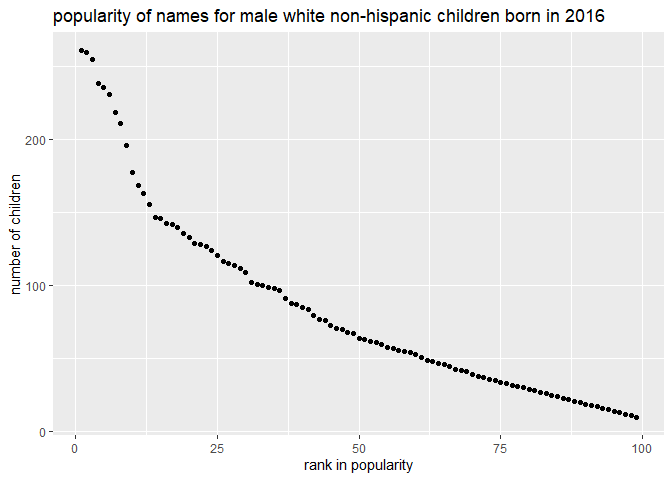

p8105\_hw2\_xl3141
================
Xinyuan Liu
2021/10/1

## Problem 1

``` r
library(tidyverse)
library(readxl)
mr_trash_wheel_df <-
  read_excel("Trash-Wheel-Collection-Totals-8-6-19.xlsx", range = "A2:N408", sheet = 1) %>% 
  janitor::clean_names() %>% 
  drop_na(dumpster) %>% ##omit rows that do not include dumpster-specific data
  mutate(across(sports_balls, round, 0)) ##round the number of sports balls to the nearest integer
```

``` r
wheel_median <- 
   mr_trash_wheel_df %>% 
   select(year, sports_balls) %>% 
   filter(year == "2017") 
median(pull(wheel_median, sports_balls)) ## calculate the median number of sports balls in a dumpster in 2017
```

In the Mr. trash wheel dataset, we have in total 344 rows and 14
columns. The variables that we are interested includes *dumpster, month,
year, date, weight\_tons, volume\_cubic\_yards, plastic\_bottles,
polystyrene, cigarette\_butts, glass\_bottles, grocery\_bags,
chip\_bags, sports\_balls, homes\_powered*. The median number of sports
ball in a dumpster in 2017 is 8.

``` r
precip_2019_df <- 
  read_excel("Trash-Wheel-Collection-Totals-8-6-19.xlsx", range = "A2:B14", sheet = 4) %>% 
  janitor::clean_names() %>% 
  drop_na() %>% ## drop na rows
  mutate(year = "2019") ##add variable "year"

precip_2018_df <- 
  read_excel("Trash-Wheel-Collection-Totals-8-6-19.xlsx", range = "A2:B15", sheet = 5) %>% 
  janitor::clean_names() %>% 
  drop_na() %>% ## drop na rows
  mutate(year = "2018") ##add variable "year"
  
precip_1819_df <- 
  bind_rows(precip_2018_df,precip_2019_df) %>% 
  mutate(month = month.name[month]) ##combine precipitation datasets and convert month to a character variable 
```

We have 18 months’ precipitation data for 2018 and 2019 in total. The
total precipitation in 2018 is 70.33, and the total precipitation in
2019 is 16.67.

## Problem 2

``` r
pol_month_df <- 
  read_csv("fivethirtyeight_datasets/pols-month.csv") %>% 
  janitor::clean_names() %>% 
  separate(mon, into = c("year", "month", "day")) %>% ##separate date into month, day, and year
  mutate(month = month.name[as.numeric(month)]) %>% ## change numeric month into character
  mutate(president = prez_gop + prez_dem) %>% ## merge columns "prez_gop" and "prez_dem"
  select(-prez_gop, -prez_dem, -day)##remove column"prez_gop", "prez_dem", "day"
```

“pol” dataset describes the number of national politicians who are
democratic or republican at any given time. It has 822 rows and 9
columns. The variable includes *year, month, gov\_gop, sen\_gop,
rep\_gop, gov\_dem, sen\_dem, rep\_dem, president*. It includes the data
from 1974 to 2015.

``` r
snp_df <- 
  read_csv("fivethirtyeight_datasets/snp.csv") %>% 
  janitor::clean_names()%>% 
  separate(date, into = c("month", "day", "year")) %>%  ##separate date into month, day, and year
  select(-day) %>% ##remove "day" column
  relocate("year", "month") %>% 
  mutate(
    year = as.numeric(year), 
    year = ifelse(year > 40, year + 1900, year + 2000),
    month = month.name[as.numeric(month)],
    year = as.character(year)##make both month and year into character variable in order to merge the dataframe
  )
range(pull(snp_df, year))
```

    ## [1] "1950" "2015"

``` r
unemploy_df <-
  read_csv("fivethirtyeight_datasets/unemployment.csv") %>% 
  janitor::clean_names() %>% 
  pivot_longer(
    jan:dec,
    names_to = "month",
    values_to = "unemployment"
    ) %>%  ## make the month into one column
  relocate("year", "month") %>% 
  mutate(
    month = str_to_title(month), 
    month = match(month, month.abb),
    month = month.name[as.numeric(month)],
    year = as.character(year) ##make both month and year into character variable in order to merge the dataframe
    )
```

``` r
new_df_1 <- left_join(pol_month_df, snp_df, by = c("year" = "year", "month" = "month")) ## join "snp_df" into "pol_month_df"
result_df <- left_join(new_df_1, unemploy_df, by = c("year" = "year", "month" = "month")) ## join the "unemploy_df" into "new_df_1"
range(pull(result_df, year))
```

    ## [1] "1947" "2015"

The result dataset has 822 rows and 11 columns. The variables includes
*year, month, gov\_gop, sen\_gop, rep\_gop, gov\_dem, sen\_dem,
rep\_dem, president, close, unemployment*. It includes the data from
1947 to 2015.

## Problem 3

``` r
pop_baby_name_df <-
  read_csv("Popular_Baby_Names.csv") %>% 
  janitor::clean_names() %>%
  mutate(
    childs_first_name = str_to_title(childs_first_name), ## capitalize the first letter
    ethnicity = recode(ethnicity, "ASIAN AND PACI" = "ASIAN AND PACIFIC ISLANDER", "BLACK NON HISP" = "BLACK NON HISPANIC", "WHITE NON HISP" = "WHITE NON HISPANIC")  ##make the name of same variable identical
    ) %>% 
  arrange(gender, ethnicity) %>% ## arrange according to gender and ethnicity
  distinct() ## remove duplicated rows
  
olivia_fem_pop_df <- 
  filter(pop_baby_name_df, childs_first_name == "Olivia" ) %>% 
  select(-gender, -childs_first_name, -count) %>% 
  pivot_wider(
    names_from = "year_of_birth",
    values_from = "rank"
  ) %>% 
  knitr::kable() ## produce the table for the popularity of "Olivia" in female for all ethnicity from 2011 to 2016
olivia_fem_pop_df
```

| ethnicity                  | 2016 | 2015 | 2014 | 2013 | 2012 | 2011 |
|:---------------------------|-----:|-----:|-----:|-----:|-----:|-----:|
| ASIAN AND PACIFIC ISLANDER |    1 |    1 |    1 |    3 |    3 |    4 |
| BLACK NON HISPANIC         |    8 |    4 |    8 |    6 |    8 |   10 |
| HISPANIC                   |   13 |   16 |   16 |   22 |   22 |   18 |
| WHITE NON HISPANIC         |    1 |    1 |    1 |    1 |    4 |    2 |

``` r
male_pop_df <- 
  filter(pop_baby_name_df, gender == "MALE", rank <= 5) %>% 
  select(-gender, -count) %>% 
  pivot_wider(
    names_from = "year_of_birth",
    values_from = "rank"
  ) %>% 
  knitr::kable() ## produce the table for the top 5 names in male for all ethnicity from 2011 to 2016
male_pop_df
```

| ethnicity                  | childs\_first\_name | 2016 | 2015 | 2014 | 2013 | 2012 | 2011 |
|:---------------------------|:--------------------|-----:|-----:|-----:|-----:|-----:|-----:|
| ASIAN AND PACIFIC ISLANDER | Ethan               |    1 |    2 |    2 |    2 |    2 |    1 |
| ASIAN AND PACIFIC ISLANDER | Ryan                |    2 |    3 |    3 |    3 |    1 |    3 |
| ASIAN AND PACIFIC ISLANDER | Muhammad            |    3 |    4 |   NA |   NA |   NA |   NA |
| ASIAN AND PACIFIC ISLANDER | Lucas               |    4 |   NA |    4 |    4 |    3 |    5 |
| ASIAN AND PACIFIC ISLANDER | Jayden              |    5 |    1 |    1 |    1 |    2 |    2 |
| ASIAN AND PACIFIC ISLANDER | Aiden               |   NA |    5 |    5 |    5 |   NA |   NA |
| ASIAN AND PACIFIC ISLANDER | Justin              |   NA |   NA |   NA |   NA |    4 |    4 |
| ASIAN AND PACIFIC ISLANDER | Eric                |   NA |   NA |   NA |   NA |    5 |   NA |
| BLACK NON HISPANIC         | Noah                |    1 |    1 |    2 |    3 |   NA |   NA |
| BLACK NON HISPANIC         | Aiden               |    2 |    3 |    3 |    3 |    2 |    2 |
| BLACK NON HISPANIC         | Elijah              |    3 |   NA |    4 |    4 |   NA |    3 |
| BLACK NON HISPANIC         | Liam                |    4 |    2 |   NA |   NA |   NA |   NA |
| BLACK NON HISPANIC         | Ethan               |    5 |    5 |    1 |    1 |    3 |   NA |
| BLACK NON HISPANIC         | Jeremiah            |   NA |    4 |    5 |   NA |    4 |    4 |
| BLACK NON HISPANIC         | Josiah              |   NA |    5 |   NA |   NA |   NA |   NA |
| BLACK NON HISPANIC         | Jayden              |   NA |   NA |    3 |    2 |    1 |    1 |
| BLACK NON HISPANIC         | Joshua              |   NA |   NA |   NA |    5 |    5 |    5 |
| HISPANIC                   | Liam                |    1 |    1 |    1 |   NA |   NA |   NA |
| HISPANIC                   | Jacob               |    2 |   NA |    2 |    2 |    2 |    3 |
| HISPANIC                   | Dylan               |    3 |    2 |    2 |    3 |   NA |   NA |
| HISPANIC                   | Matthew             |    4 |    4 |   NA |    4 |    3 |    4 |
| HISPANIC                   | Noah                |    5 |    5 |    3 |   NA |   NA |   NA |
| HISPANIC                   | Ethan               |   NA |    3 |    5 |    5 |    4 |   NA |
| HISPANIC                   | Jayden              |   NA |   NA |    4 |    1 |    1 |    1 |
| HISPANIC                   | Angel               |   NA |   NA |   NA |   NA |    5 |    5 |
| HISPANIC                   | Justin              |   NA |   NA |   NA |   NA |   NA |    2 |
| WHITE NON HISPANIC         | Joseph              |    1 |    2 |    1 |    2 |    1 |    2 |
| WHITE NON HISPANIC         | Michael             |    2 |   NA |    3 |    3 |    3 |    1 |
| WHITE NON HISPANIC         | David               |    3 |    1 |    2 |    1 |    2 |    4 |
| WHITE NON HISPANIC         | Moshe               |    4 |    3 |    4 |    4 |    5 |   NA |
| WHITE NON HISPANIC         | Jacob               |    5 |    4 |    5 |   NA |    4 |    3 |
| WHITE NON HISPANIC         | Benjamin            |   NA |    5 |   NA |   NA |   NA |    5 |
| WHITE NON HISPANIC         | Daniel              |   NA |   NA |   NA |    5 |   NA |   NA |

``` r
name_vs_pop_df <-
  pop_baby_name_df %>% 
  filter(year_of_birth == "2016", ethnicity == "WHITE NON HISPANIC", gender == "MALE") ##dataset with names of male white non-hispanic children born in 2016

ggplot(name_vs_pop_df, aes(x = rank, y = count)) + geom_point() + xlab("rank in popularity") + ylab("number of children") + ggtitle("popularity of names for male white non-hispanic children born in 2016") ##scatterplot for number of children with a name against rank in popularity of that name
```

<!-- -->

``` r
ggsave("scatter_plot.pdf")
```
